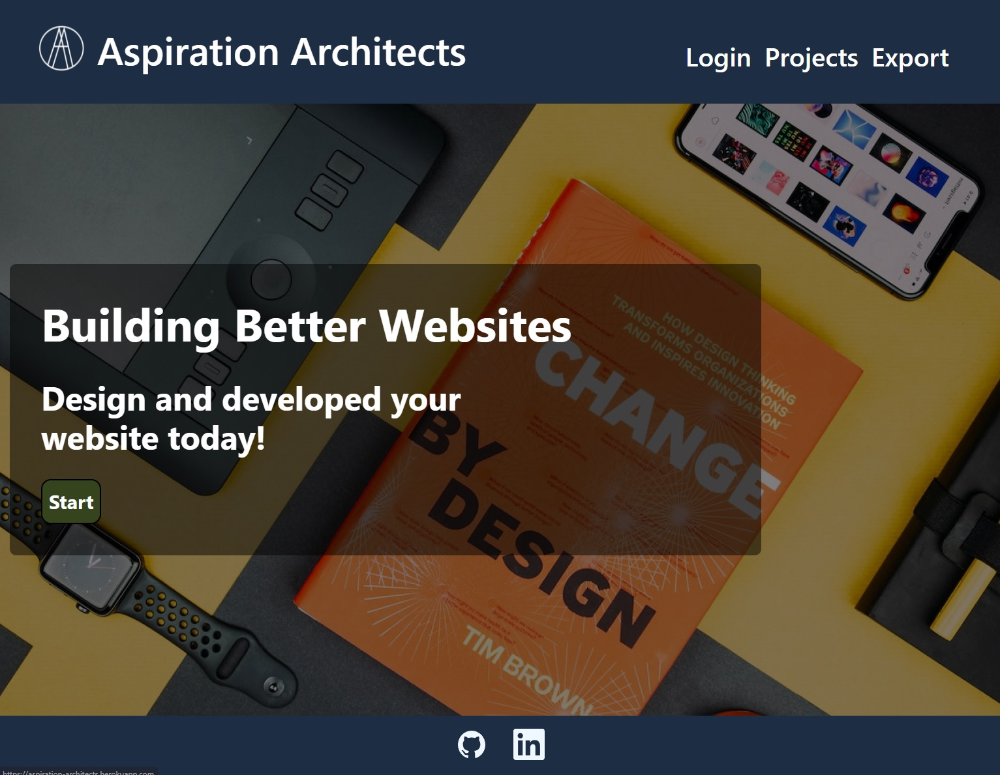
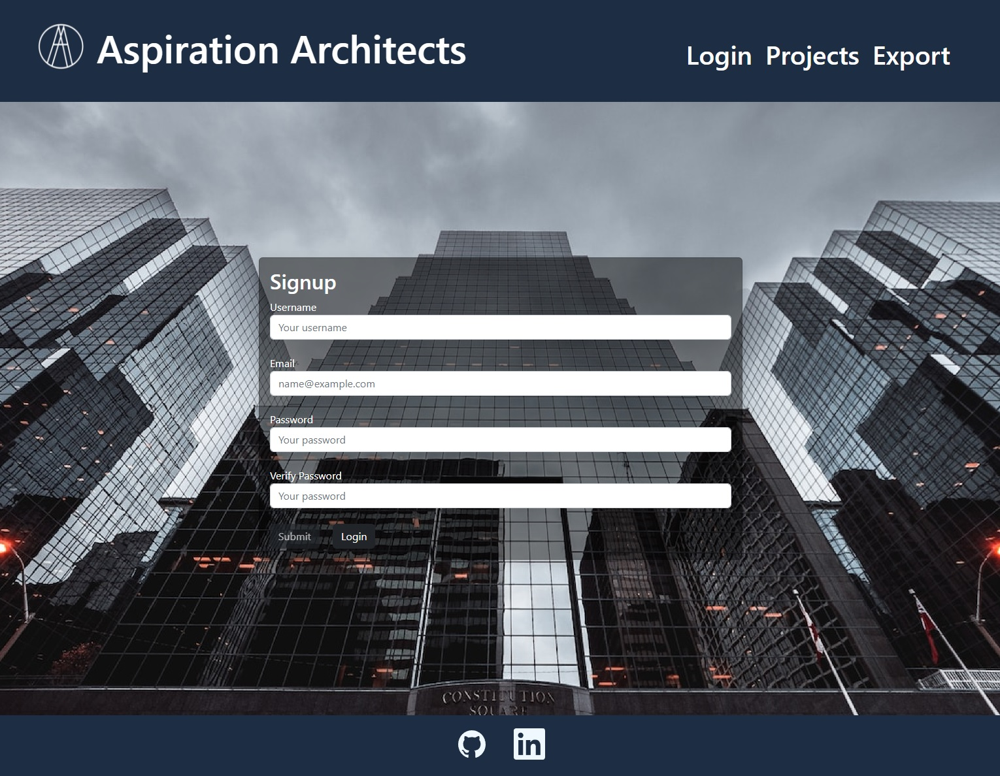
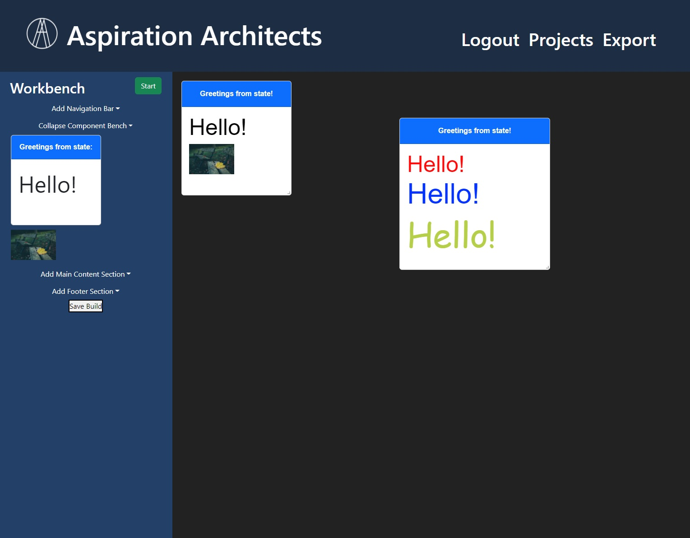

# Website Builder

[Deployed application](https://aspiration-architects.herokuapp.com/)


---

### Table of Contents

- [Description](#description)
- [Usage](#usage)
- [Technologies](#technologies)
- [Screenshots](#screenshots)
- [Code Snippets](#code-snippets)
- [License](#license)
- [Authors](#authors)

---

## Description

This is a website that builds websites. You have to have an account to start buliding a website; if you don't have an account, you can create one via the signup page. Once you have an account and are logged in, you can create a website. Just a note: as the author of this section (Adam Ferro), I am 100% behind reaching for stars as far as goals go; starting out with an ideal and striving to reach that ideal is how I really learn new concepts and improve my craft. But this website, in retrospect, was too much to build in one week while still having a polished final product. As such, it is less a functional website and more of a minimum viable product. I will work on this website in the coming month and push up my changes after its graded, so until then it's going to be pretty rough as far as polish is concerned.

## Usage

Navigate to <https://aspiration-architects.herokuapp.com/>. First, you have to create an account. Once you create an account, click the 'Projects' navigation link at the top, then click on 'new project'. Click the 'Add Navigation Bar' to see all of the options that you have to create a header. Click on the submit/update image and then upload to add an image to the header. Once you select all of the settings that you want, click the 'submit nav settings' to add the header to the page. Click the 'Add Components' button to add components to the page.

The only components that I had time to add were a card component and an image component. You can create a new card by dragging the card component in the sidebar to the build workbench screen. On each card, you can resize the card by dragging the resize handle in the bottom-right hand corner of the screen. When you hover over a card, a close icon pops up in the upper left hand corner of the screen. If you click that, it removes the card from the workbench page.

If you hover over the header of a card, an edit icon appears in the upper right hand corner of the card. When you click the edit icon, you have the option of changing the background color, the text content, the text color, the text size, and the text font of the card header, along with an option to remove the header.

If you hover over the card body, you have an option to edit the background color of the card, or add more text. If you removed the card header, you also have the option to add the card header back on to the card.

If you hover over the body text, you have the option of changing the font color, the font family, the font size, and the text content of the body text, and you also have the option of remove the text completely from the body.

There's also an editable image component. If you click the component that says 'Click or Drop here', you can select an image from your file system to replace the component. Currently, we only support a 1.5:1 aspect ratio as that is the ratio of the images that I downloaded from <https://randomwordgenerator.com/picture.php> were for testing purposes: any other ratio will look weird and tiled at the moment. You can also drag an image from your file system into the 'Click or Drop here' button and the image will be loaded into the component. Once an image is loaded into the component, you can drag the image into a card and the image will be added to the card. You can remove an image by clicking the close icon that pops up when you hover over it. I have more features planned for the future for image components (I have image resizing implemented already, it's just not on the deployed site, for example). Oh, you can also drag an image from your file system onto an image that's in a card, and the image will change as well (its just at a fixed ratio).

If you click on the 'Add Content Section' button, you can select options for the main content section (like background image, background color, etc). If you click on the 'Add Footer' button, you can select options to add a footer.

Click on the 'save build' button to save the created site.

## Technologies

- [React](https://reactjs.org/)
- [React DnD](https://react-dnd.github.io/react-dnd/)
- [MongoDB](https://www.mongodb.com/)
- [Material UI](https://mui.com/)
- [Bootstrap](https://getbootstrap.com/)
- [Node.js](https://nodejs.org/en/)
- [JavaScript](https://www.javascript.com/)
- [HTML](https://developer.mozilla.org/en-US/docs/Web/HTML)
- [CSS](https://developer.mozilla.org/en-US/docs/Web/CSS)

## Screenshots

### Home Page



### Sign-up Page



### Build Page



## Code Snippets

### Setting the card components absolute position.

```JavaScript
const moveCard = useCallback(
        (id, left, top) => {
            const newCards = [...cards];
            newCards[id].left = left;
            newCards[id].top = top;

            setCards(newCards);
        },
        [cards, setCards],
    );
```

### Checking setting loggedIn status

```js
<li className="">
  {Auth.loggedIn() ? (
    <a className="header_link">
      <p id="logout_button" className="nav_link" onClick={Auth.logout}>
        Logout
      </p>
    </a>
  ) : (
    <Link to="/login" className="header_link">
      <p className="nav_link">Login</p>
    </Link>
  )}
</li>
```

## License

[MIT](https://opensource.org/licenses/MIT) License.

## Authors

Like our work? Reach out to us!

Adam Ferro

- [LinkedIn](https://www.linkedin.com/in/adam-ferro/)
- [GitHub](https://github.com/GeminiAd)

Dominic Conradson

- [LinkedIn](https://www.linkedin.com/in/dominic-conradson-76638b172/)
- [GitHub](https://github.com/theDomConrad)

Mason Davis

- [LinkedIn](https://www.linkedin.com/in/davis-mason-t/)
- [GitHub](https://github.com/Md7113)

Kyle Vance

- [LinkedIn](https://www.linkedin.com/in/kyle-s-vance/)
- [GitHub](https://github.com/KVance1010)
